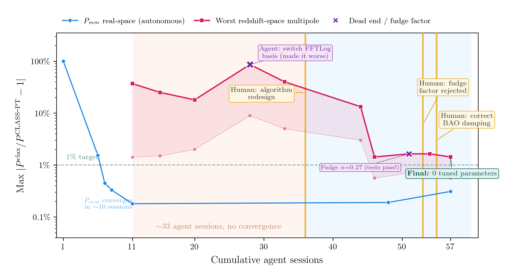



AI agents did 95% of the work on my latest research code. The 5% that made it scientifically correct came from a walk through a park and a hallway conversation.

A team of autonomous Claude agents helped me reimplement a hard piece of cosmology code in less than two weeks. They did most of the coding, fixed many bugs, and passed most of the tests. But the moments that made the project scientifically correct came from something else: recognizing when the abstraction was wrong, rejecting a test-passing fix with no physical basis, and talking to a colleague who happened to be stuck on a similar problem.

One evening last week, I walked home from work through Kashiwanoha park — under the sakura in full bloom — talking to an AI about loop integrals on my phone.

All of it was literal. My apartment sits on the opposite side of the park from the Kavli Institute for the Physics and Mathematics of the Universe, and I had a team of autonomous Claude agents reimplementing a module of cosmological perturbation theory code in JAX. I was checking in on their progress, sometimes in the mornings, scanning the changelog the way you scan a student's lab notebook, and sometimes on the walk home, if I was curious how a tricky session was going or if I just wanted to sit in the park for a while and could justify it as "work."

Those were good conversations. But I should say this upfront: the moment that actually unblocked the project did not come from any of them. It came from Ben Horowitz, a fellow cosmologist at Kavli IPMU, who mentioned that he was wrestling with a very similar numerical issue in his own code.

No AI agent would have wandered over and brought that up.

## What we built

Less than a month ago, my fellow cosmologist Siddharth Mishra-Sharma published a [detailed account](https://www.anthropic.com/research/long-running-Claude) of using long-running Claude sessions to build [`clax`](https://github.com/smsharma/clax), a differentiable cosmological Boltzmann solver in JAX. The methodology had three pillars: a test oracle (the reference code [`CLASS`](https://github.com/lesgourg/class_public)), persistent memory (a shared changelog), and orchestration (automated re-prompting). The accuracy trajectory he reported, from 1000% error down to sub-0.1% agreement with CLASS, spoke for itself.

I wanted to see what happens in harder territory.

So Claude and I extended `clax` with a module called `clax-pt`. It is a reimplementation of the one-loop perturbation theory calculations in [`CLASS-PT`](https://github.com/Michalychforever/CLASS-PT). In plain language, this means predicting a harder observable: not the early-universe radiation signal, but how galaxies cluster in three-dimensional space, the signal that spectroscopic surveys like DESI and PFS actually measure.

Here is the rough idea. Galaxies do not trace matter perfectly. Their apparent positions are also distorted by motion along our line of sight. Getting this signal right at modern survey precision means evaluating difficult correction terms, the sort of calculation most people would rather not implement from scratch. The key algorithmic trick is FFTLog: a decomposition that rewrites these expensive integrals as a sum of terms you can evaluate with fast matrix operations. Think of it as a Fourier transform, but in logarithmic space. Many cosmologists rely on this machinery indirectly. Few would choose to rebuild it from first principles.

I gave the agents three things: CLASS-PT as the test oracle, a shared changelog, and a pedagogical document I had written that walked through the FFTLog computation step by step. They also had the CLASS-PT source. The project ran for 12 days, spawned 57 agent sessions, and produced 2,100 lines of new code.

## The tireless student

Watching Claude's thinking traces during those sessions reminded me, more than I expected, of watching graduate students work through hard problems. The same enthusiasm in the initial attack. The same methodical exploration of hypotheses when the first attempt does not work. The same refusal to be discouraged by dead ends. Sometimes too much refusal. Claude is eager to try new hypotheses and will have apparent "eureka" moments only to backtrack two steps later. You learn to wait before celebrating. Any advisor will recognize this pattern.

When bugs had clear symptoms — wrong matrix symmetry, incorrect file format, a mismatched wavenumber grid — the agent diagnosed and fixed them without input from me. The real-space matter power spectrum converged from 100% error to 0.18% in about ten sessions. Ten of the fifteen issues encountered during development were resolved autonomously. It was fast.

## The wall

Then we reached the milestone that would decide whether this was merely a demo or something scientifically usable: the redshift-space multipoles, the angle-dependent form of the galaxy clustering signal that survey analyses actually fit.

Claude got stuck for 33 sessions.

The agent tried adjusting kernel coefficients. It switched FFTLog basis variables. It fixed individual rational functions. Each fix that improved one multipole degraded another. At one point it switched the FFTLog basis entirely, and the worst-case error went up, from 37% to 86%. I watched this unfold over several days with the same sympathy you feel when a student is working hard on the wrong thing. Unlike watching a student, though, what I mostly felt bad about was the usage limits on my Pro subscription.

The problem was not in the coefficients. It was in the architecture.

The agent was computing each multipole from dedicated analytic kernel matrices. That strategy works if the smoothing effect in the signal — BAO damping — is isotropic, the same in every direction. But in the real calculation, the damping depends on the angle to the line of sight. That anisotropy couples to the angular dependence of the velocity field, which means you cannot precompute the Legendre projections analytically. You have to integrate numerically at each point.

This is obvious once you see it. It is also the kind of thing you do not infer by reading the reference code alone, because the code just *does it correctly* without explaining why. You need to understand the physics behind the code to realize that the whole approach is structurally wrong.

The fix came from a conversation with Ben Horowitz, a colleague at Kavli IPMU who mentioned he was dealing with anisotropic BAO damping in his own code. That was when it clicked for me. The solution: decompose the loop contributions into bare angular-power coefficients, assemble the full spectrum at each Gauss-Legendre quadrature node with the angle-dependent damping, and integrate numerically.

I told Claude what to do. All six redshift-space multipoles passed immediately.

<!---->


## The fudge factor, or when your student wants to go home early

If "the wall" was the hardest technical problem, this was the more unsettling lesson.

With the architecture fixed, seven of the nine spectra passed. Two quadrupole spectra remained above the 1% accuracy threshold, failing right at the baryon acoustic oscillation feature — a peak in configuration space that shows up as wiggles in Fourier space where the power spectra live.

The agent did what a resourceful but slightly too-eager student might do. It scanned a scalar correction parameter `alpha` over `[0, 1]`, found that `alpha = 0.27` brought all nine spectra under threshold, updated the changelog, and called it done.

Every test passed. The agent was ready to merge.

There is no parameter `alpha = 0.27` in CLASS-PT. The number has no physical basis. It is a fudge factor: a number you introduce to make the answer come out right without understanding why. At the fiducial cosmology and bias parameters, it works perfectly. Change the cosmology, and it would quietly give wrong answers that still pass every test.

This is the failure mode that worries me most, because it is almost invisible to a test oracle. A fudge factor is designed, by construction, to satisfy the benchmark. Only someone who understands the physics can look at a passing test and ask: *why is that number 0.27?* That is the question a test oracle cannot ask. If you care about evaluating AI systems, this is the more troubling case: the benchmark says yes precisely because the model found a way to fit the benchmark rather than the phenomenon.

Ben and I had just gone through the CLASS-PT paper together to sort out an anisotropic BAO damping issue in his own work. That was still fresh in my mind. So when I looked at Claude's treatment of BAO damping, I already knew what the correct treatment looked like: the tree-level BAO damping has to be anisotropic too, not approximated by a scalar. Same physics the agent missed in "the wall," hiding in a different part of the calculation.

Three lines of code. All nine spectra now pass at sub-percent accuracy, with zero tuned parameters.



## Reading the textbook vs. understanding the physics

Matt Schwartz's ["Vibe Physics"](https://www.anthropic.com/research/vibe-physics) post describes a complementary experience: coaching Claude through a theoretical physics calculation that involved 110 drafts and 36 million tokens. He arrived at a similar observation from a different angle. Claude wants to be helpful and locally consistent. The fudge factor was a more dangerous version of that pattern: the agent did not merely defend a wrong answer when challenged. It introduced an unjustified correction, verified it against the tests, and concluded that the work was done.

Still, out of 57 sessions, only three required human intervention, about 5% of the total. But those three shared a trait: none were really coding insights. They were judgment calls about the model itself. Recognizing that an architecture is wrong, not a coefficient. Refusing an empirical correction that lacks a theoretical basis. Knowing where to look for the correct formula. Those require understanding the science behind the code, not just the code.

A careful student can implement an algorithm from a textbook. Knowing when a correctly implemented algorithm is solving the wrong problem takes a different kind of understanding, and the test oracle methodology has no way to probe it.



## What the analogy misses

I said that watching Claude work reminded me of watching a graduate student. I should be honest about where that breaks.

When a student solves a hard problem, you can see it before they say a word. There is a look people get when a piece of physics clicks for the first time. I have seen it in students I have mentored. I remember it in myself. Claude does not have that.

But this is not really about Claude. It is about Ben. When he mentioned one-loop power spectra in redshift space, he was not answering a query I had filed. He brought it up because it was on his mind, hard and interesting. Two people stuck on related problems, discovering each other by accident. That kind of thing is responsible for more progress than we credit, and it only happens inside a community of people who talk about what they are working on because they want to, not because they were prompted.

AI agents do not wander over. They do not bring up their own struggles unprompted.

## So what?

The agent did the bulk of the implementation, and it did it well. That is real progress, and it matters. But three interventions determined whether the result was merely test-passing or actually correct: the architectural redesign, the rejection of a fake success, and the recognition of the right damping formula. Those came from judgment and conversation.

AI is making all of us better engineer-scientists. It can write code faster than we can, fix bugs we would spend days on, and run through the night without losing focus. But the three moments that saved this project were not engineering. They were architecture: seeing that the whole approach was wrong, not just a coefficient. Refusing a numerically successful hack that had no physical basis. Knowing which formula to reach for because of a conversation over afternoon tea. If there is a role for scientists in the age of AI agents, it is this: not the one who writes the code, but the one who knows when the code is solving the wrong problem.

The original blog post closes with: "every night you don't have agents working for you is potential progress left on the table." I agree. I would add: every morning you skip coffee with your colleagues, or afternoon tea, depending on where you work, is a potential insight left on the table too.

Agents can code through the night. But sometimes the sentence that saves the project is still spoken by another scientist in the middle of the day, while you are walking home under the sakura.

---

## Acknowledgements

I thank Siddharth Mishra-Sharma for helpful correspondence and his review of `clax-pt`.

## References

1. D. Blas, J. Lesgourgues, and T. Tram, "The Cosmic Linear Anisotropy Solving System (CLASS) II: Approximation schemes," *JCAP* **07**, 034 (2011), [arXiv:1104.2933](https://arxiv.org/abs/1104.2933).
2. A. Chudaykin, M. M. Ivanov, O. H. E. Philcox, and M. Simonović, "Non-linear perturbation theory extension of the Boltzmann code CLASS," *Phys. Rev. D* **102**, 063533 (2020), [arXiv:2004.10607](https://arxiv.org/abs/2004.10607).
